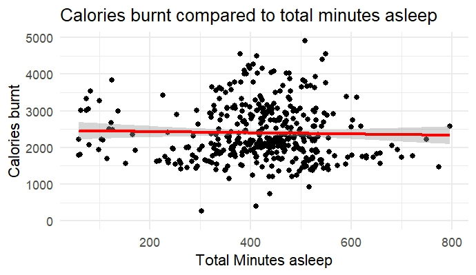
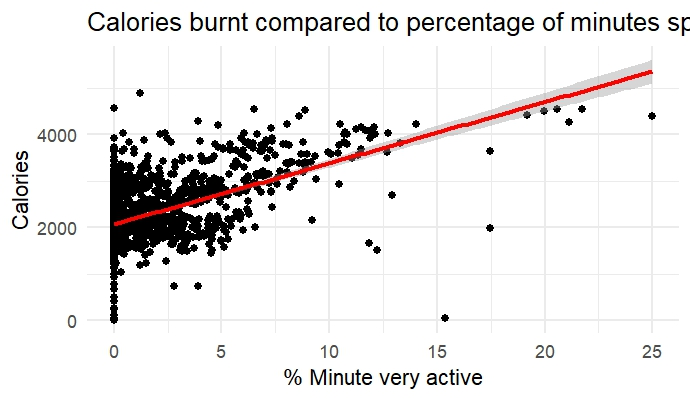
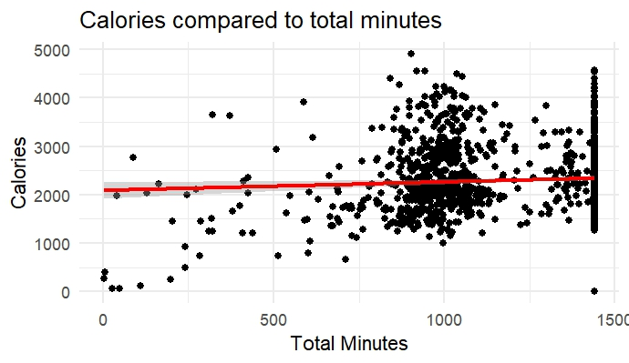
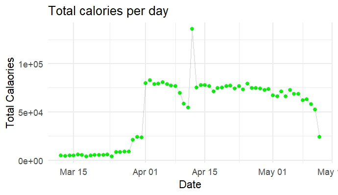
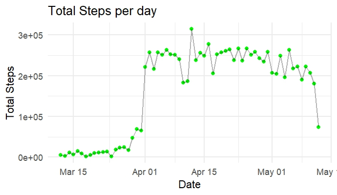
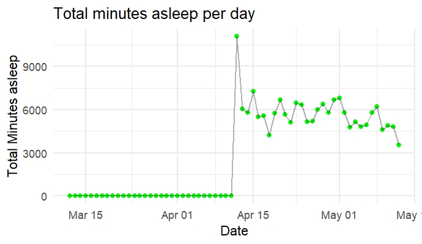
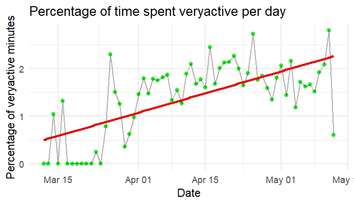

[README.md](https://github.com/user-attachments/files/26218232/README.md)
# Fitbit Activity & Wellness Data Analysis
**Google Data Analytics Capstone — Bellabeat Case Study**

> An end-to-end data analysis project in R exploring smart device usage patterns from Fitbit tracker data. The goal is to uncover insights about user activity, calorie burn, and sleep behaviour to inform marketing strategy recommendations for Bellabeat — a women's wellness technology company.

---

## Table of Contents

1. [Project Overview](#1-project-overview)
2. [Business Task](#2-business-task)
3. [Data Sources](#3-data-sources)
4. [Data Cleaning & Preparation](#4-data-cleaning--preparation)
5. [Data Merging & Feature Engineering](#5-data-merging--feature-engineering)
6. [Exploratory Analysis & Visualisations](#6-exploratory-analysis--visualisations)
7. [Regression Models](#7-regression-models)
8. [Key Findings](#8-key-findings)
9. [Recommendations](#9-recommendations)
10. [Tools & Packages](#10-tools--packages)

---

## 1. Project Overview

This project analyses personal fitness tracker data from **33 Fitbit users** across two export periods (March–May 2016) to understand how users engage with activity tracking, calorie burn, and sleep monitoring. The insights are intended to guide Bellabeat's product and marketing decisions.

---

## 2. Business Task

**Question:** How do consumers use non-Bellabeat smart devices, and how can these trends inform Bellabeat's marketing strategy?

**Stakeholders:**
- Urška Sršen — Co-founder and Chief Creative Officer, Bellabeat
- Sando Mur — Co-founder, Bellabeat

---

## 3. Data Sources

| Dataset | Period | Key Fields |
|---|---|---|
| `dailyActivity_merged` (export 1) | Apr 12 – May 12, 2016 | Steps, distance, active minutes, calories |
| `dailyActivity_merged` (export 2) | Mar 12 – Apr 11, 2016 | Steps, distance, active minutes, calories |
| `dailyCalories_merged` | Apr 12 – May 12, 2016 | Daily calorie burn per user |
| `sleepDay_merged` | Apr 12 – May 12, 2016 | Total sleep records, minutes asleep, time in bed |

**Data source:** [FitBit Fitness Tracker Data](https://www.kaggle.com/datasets/arashnic/fitbit) (Kaggle, CC0 Public Domain)

**Limitations:**
- Only 33 users — small sample size limits generalisability
- No demographic data (age, gender, location)
- Data is from 2016 — user behaviour may have shifted significantly

---

## 4. Data Cleaning & Preparation

### Load packages

```r
install.packages("tidyverse")
library(tidyverse)
library(ggplot2)
library(tidyr)
library(dplyr)
library(lubridate)
```

### Load CSV files

```r
dailyactivity1 <- read.csv(".../dailyActivity_merged.csv")  # Apr–May export
dailyactivity2 <- read.csv(".../dailyActivity_merged.csv")  # Mar–Apr export
calories_daily <- read.csv(".../dailyCalories_merged.csv")
sleep_day      <- read.csv(".../sleepDay_merged.csv")
```

### Initial exploration

```r
head(dailyactivity1)
glimpse(dailyactivity1)
colnames(dailyactivity1)
sum(is.na(dailyactivity1))
summary(dailyactivity1)
```

### Convert date columns to proper Date type

The `ActivityDate` column in the activity files and `ActivityDay` in the calories file were stored as character strings. These were parsed and renamed to a consistent `Activitydate` column across all datasets.

```r
# Activity files
dailyactivity1 <- dailyactivity1 %>%
  mutate(Activitydate = as_date(mdy(ActivityDate))) %>%
  select(-ActivityDate)

dailyactivity2 <- dailyactivity2 %>%
  mutate(Activitydate = as_date(mdy(ActivityDate))) %>%
  select(-ActivityDate)

# Calories file
calories_daily <- calories_daily %>%
  mutate(Activitydate = as_date(mdy(ActivityDay))) %>%
  select(-ActivityDay)

# Sleep file — strip timestamp, extract date only
sleep_day <- sleep_day %>%
  mutate(Activitydate = as_date(mdy_hms(SleepDay))) %>%
  select(-SleepDay)
```

---

## 5. Data Merging & Feature Engineering

### Merge the two activity exports

```r
daily_activity <- bind_rows(dailyactivity1, dailyactivity2)

# Validate row count
nrow(daily_activity) == nrow(dailyactivity1) + nrow(dailyactivity2)  # TRUE
```

### Merge all datasets on Id + Activitydate

```r
merged_file <- daily_activity %>%
  full_join(calories_daily, by = c("Id", "Activitydate")) %>%
  full_join(sleep_day,      by = c("Id", "Activitydate"))
```

### Resolve duplicate calorie columns

After the join, two calorie columns (`Calories.x`, `Calories.y`) existed. The maximum of the two was taken, treating NA values correctly.

```r
merged_file_final <- merged_file %>%
  mutate(calories = if_else(
    is.na(Calories.x) & is.na(Calories.y),
    NA_real_,
    pmax(Calories.x, Calories.y, na.rm = TRUE)
  )) %>%
  select(-Calories.x, -Calories.y)
```

### Create new features

**Total minutes** (sum of all activity intensity categories) and **Very Active Minutes Percentage** (proportion of the day spent at high intensity).

```r
merged_file_final <- merged_file_final %>%
  mutate(
    TotalMinutes = rowSums(across(c(
      VeryActiveMinutes, FairlyActiveMinutes,
      LightlyActiveMinutes, SedentaryMinutes
    ))),
    VeryActiveMinutesPercentage = round((VeryActiveMinutes / TotalMinutes) * 100, 2)
  )
```

---

## 6. Exploratory Analysis & Visualisations

### Calories burned vs. total minutes asleep

```r
ggplot(data = merged_file_final, aes(x = TotalMinutesAsleep, y = calories)) +
  geom_point() +
  theme_minimal() +
  geom_smooth(method = "lm", col = "red") +
  labs(
    title = "Calories burnt compared to total minutes asleep",
    x = "Total Minutes Asleep",
    y = "Calories Burnt"
  )
```



---

### Calories burned vs. percentage of very active minutes

```r
ggplot(data = merged_file_final, aes(x = VeryActiveMinutesPercentage, y = calories)) +
  geom_point() +
  theme_minimal() +
  geom_smooth(method = "lm", col = "red") +
  labs(
    title = "Calories burnt compared to percentage of minutes spent being very active",
    x = "% Minutes Very Active",
    y = "Calories"
  )
```



---

### Calories burned vs. total minutes of activity

```r
ggplot(data = merged_file_final, aes(x = TotalMinutes, y = calories)) +
  geom_point() +
  theme_minimal() +
  geom_smooth(method = "lm", col = "red") +
  labs(
    title = "Calories compared to total minutes",
    x = "Total Minutes",
    y = "Calories"
  )
```



---

### Total calories per day (all users)

```r
merged_file_final %>%
  group_by(Activitydate) %>%
  summarise(total_calories = sum(calories, na.rm = TRUE)) %>%
  ggplot(aes(x = Activitydate, y = total_calories)) +
  geom_point(colour = "green") +
  geom_line(alpha = 0.1) +
  theme_minimal() +
  labs(title = "Total calories per day", x = "Date", y = "Total Calories")
```



---

### Total steps per day

```r
merged_file_final %>%
  group_by(Activitydate) %>%
  summarise(total_steps = sum(TotalSteps, na.rm = TRUE)) %>%
  ggplot(aes(x = Activitydate, y = total_steps)) +
  geom_point(colour = "green") +
  geom_line(alpha = 0.3) +
  theme_minimal() +
  labs(title = "Total Steps per day", x = "Date", y = "Total Steps")
```



---

### Total minutes asleep per day

```r
merged_file_final %>%
  group_by(Activitydate) %>%
  summarise(total_minutes_asleep = sum(TotalMinutesAsleep, na.rm = TRUE)) %>%
  ggplot(aes(x = Activitydate, y = total_minutes_asleep)) +
  geom_point(colour = "green") +
  geom_line(alpha = 0.3) +
  theme_minimal() +
  labs(title = "Total minutes asleep per day", x = "Date", y = "Total Minutes Asleep")
```



---

### Average % very active minutes per day (trend)

```r
merged_file_final %>%
  group_by(Activitydate) %>%
  summarise(veryactiveminute_perc = mean(VeryActiveMinutesPercentage, na.rm = TRUE)) %>%
  ggplot(aes(x = Activitydate, y = veryactiveminute_perc)) +
  geom_point(colour = "green") +
  geom_line(alpha = 0.3) +
  geom_smooth(method = "lm", color = "red", se = FALSE) +
  theme_minimal() +
  labs(
    title = "Percentage of time spent very active per day",
    x = "Date",
    y = "% Very Active Minutes"
  )
```



---

## 7. Regression Models

Three linear regression models were fitted to identify which activity variables best predict calorie burn.

### Model 1 — Calories ~ Minutes Asleep

```r
model_sleep <- lm(calories ~ TotalMinutesAsleep, data = merged_file_final)
summary(model_sleep)
```

| Metric | Value |
|---|---|
| Intercept | 2,466.07 |
| Coefficient | −0.1657 per minute asleep |
| p-value | 0.596 |
| R² | 0.0006635 |

**Interpretation:** No statistically significant relationship. Sleep duration explains less than 0.1% of the variation in calories burned.

---

### Model 2 — Calories ~ % Very Active Minutes ⭐ Strongest predictor

```r
model_PercActiveMinutes <- lm(calories ~ VeryActiveMinutesPercentage, data = merged_file_final)
summary(model_PercActiveMinutes)
```

| Metric | Value |
|---|---|
| Intercept | 2,069.62 |
| Coefficient | +131.79 per 1% increase in very active time |
| p-value | < 2e-16 |
| R² | 0.2863 |

**Interpretation:** Highly statistically significant. For every 1% increase in the proportion of time spent being very active, calories burned increase by ~132. Exercise **intensity** is far more predictive of calorie burn than exercise duration.

---

### Model 3 — Calories ~ Total Minutes

```r
model <- lm(calories ~ TotalMinutes, data = merged_file_final)
summary(model)
```

| Metric | Value |
|---|---|
| Intercept | 2,086.54 |
| Coefficient | +0.1753 per total minute |
| p-value | 0.0115 |
| R² | 0.004555 |

**Interpretation:** Statistically significant but with very weak explanatory power. Total time spent active explains only 0.45% of calorie variation — confirming that intensity, not volume, drives calorie burn.

---

## 8. Key Findings

1. **Intensity beats duration.** The percentage of time spent at very high intensity (VeryActiveMinutesPercentage) is the strongest predictor of calorie burn (R² = 0.29, p < 0.001). Total minutes of activity has minimal predictive power (R² < 0.005).

2. **Sleep has no meaningful impact on calorie burn.** The relationship between total minutes asleep and calories burned is statistically non-significant (p = 0.596), suggesting that sleep tracking data does not directly explain energy expenditure patterns in this dataset.

3. **Most tracked time is sedentary.** Summary statistics reveal that the majority of users' tracked minutes fall in the `SedentaryMinutes` category, indicating low overall physical activity intensity across the sample.

4. **Calorie and step trends are relatively stable over the study period**, with no dramatic trend upward or downward across the 60-day window — suggesting consistent habitual behaviour rather than goal-driven activity spikes.

5. **High variability in very active minute percentages** across users suggests the sample spans a wide spectrum of fitness levels, from highly sedentary to regularly active individuals.

---

## 9. Recommendations

**For Bellabeat's marketing and product teams:**

**1. Market around intensity, not just steps or time.**
Users and the data both show that high-intensity effort — not time spent moving — is the real driver of calorie burn. Bellabeat's messaging should emphasise quality of movement over quantity. Feature in-app metrics like "intensity score" or "high-effort minutes" prominently in the Bellabeat app.

**2. Use push notifications to encourage intensity bursts.**
Since even a small increase in the proportion of very active time significantly increases calories burned, Bellabeat's app could prompt users mid-session to "push harder for the next 5 minutes" — a low-effort, high-impact nudge.

**3. Reframe sleep tracking as recovery, not calorie management.**
Sleep duration alone does not predict calorie burn. Bellabeat should position sleep tracking as a recovery and wellbeing tool rather than linking it to weight or calorie outcomes — which could mislead users and reduce trust.

**4. Target sedentary users with gentle activity goals.**
The large proportion of sedentary minutes in the data suggests that many users are relatively inactive. Bellabeat could develop campaigns and app features targeting sedentary users — for example, hourly movement reminders or "start small" challenges tied to the Leaf or Time devices.

**5. Leverage consistency data for retention campaigns.**
Calorie and step trends are stable over time for most users. Bellabeat can use this consistency in marketing — showing that their users build lasting habits, not just short-term motivation spikes.

---

## 10. Tools & Packages

| Tool / Package | Purpose |
|---|---|
| R / RStudio | Primary analysis environment |
| `tidyverse` | Data manipulation and visualisation framework |
| `ggplot2` | Chart creation |
| `dplyr` | Data wrangling and transformation |
| `tidyr` | Data reshaping |
| `lubridate` | Date parsing and formatting |

---

*Analysis completed as part of the Google Data Analytics Professional Certificate — Course 8 Capstone Project.*
